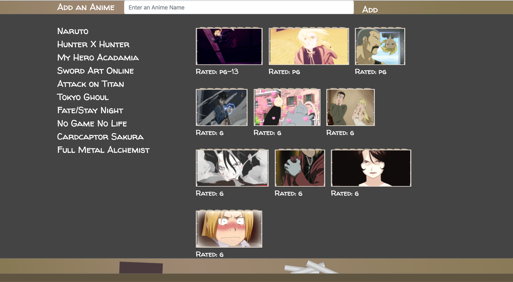

# Giphy-API

## What is this APP?
This app uses the giphy api to generate gif to the user when the user searches a keyword. The theme revolving this app is anime. 

## How to Use It?
There are 10 pre-populated buttons when the app first load. The user can add a button for a new anime using the add button. When the user click on the anime button, the app will generate 10 random static gif related to that anime topic and display it on the screen. The user can click on the actual gif to animate it or pause it.

## Technologies Used:
+ HTML
+ CSS
+ Bootstrap
+ Javascript
+ jQuery

## Essential Codes:
The codes below uses the jQuery ajax method to retrieve a JSON from the giphy API base on the keyword the user search with. Then the app will read the properties of the JSON and retrieve the url for the gif and the rating. These information will be added to the HTML.
```
function displayAnimeGif() {
    $("#gif-view").empty()
    var anime = $(this).attr("data-name");
    var queryURL = "https://api.giphy.com/v1/gifs/search?q=" + anime + "&limit=10&api_key=2bzoaF3rvh4MyuC2guRzuaQwRPP8yLlQ"
    $.ajax({
      url: queryURL,
      method: "GET"
    }).then(function (response) {
      for (var i = 0; i < response.data.length; i++) {
        var newDiv = $("<div>")
        newDiv.addClass("gif-container animated swing")
        var gifImg = $("")
        gifImg.addClass("gif")
        gifImg.attr("src", response.data[i].images["fixed_height_small_still"].url)
        gifImg.attr("data-still", response.data[i].images["fixed_height_small_still"].url)
        gifImg.attr("data-animate", response.data[i].images["fixed_height_small"].url)
        gifImg.attr("data-motion", "still")
        var rating = $("<p>")
        rating.addClass("rating")
        rating .text("Rated: " + response.data[i].rating)
        newDiv.append(gifImg , rating)
        $("#gif-view").prepend(newDiv)
      }
    });
  }
  ```
